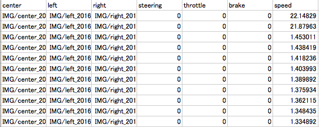
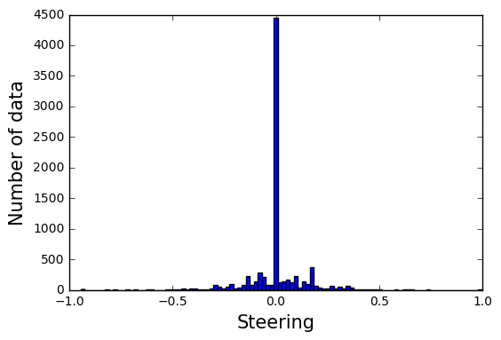
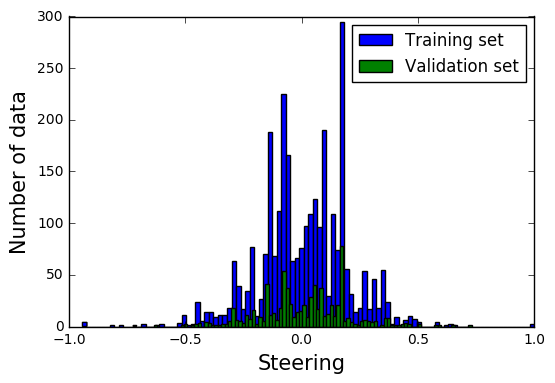
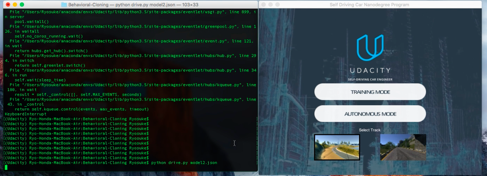

# Behavioral-Cloning
Use Deep Learning to Clone Driving Behavior

## File Structure
- model.py - The script used to create and train the model.
- drive.py - The script to drive the car.
- model2.json - The model architecture.
- model2.h5 - The model weights.
- README.md - explains the structure of your network and training approach.
- EDA.html,EDA.ipynb - Exploratory data analysis(EDA.ipynb is not functional since this repository doesn't include the full images)

## Project Overview
The objective of this project is to develop a deep larning based algorithim to clone human driving behavior. The data used in this project is generated (by me) while running the Track 1 in the simulator. The simulator game outputs the camera image from front, left and right with other infomation such as steering, brake, and throttle.
The input data is the image taken in the simulator and the output is the steering angle of the car. I didn't use any other infomation apart from images and steering angle since the clone driver (generated by my deep learning approach) should have the roubustness to run in the other condition (For example truck 2 in the simulator).

Fig.1: Data Structure

## Approach
I used the deep learning based algorithm to clone human driving behavior. The training data is the image of the center view and the label of the data is the steering angle. When it comes to using it in the real world, the image from the center isn't enough to learn the human behavior. However, running zigzag is not good idea to capture the road condition(and dangerous in the real world). Therefore, I used the left and right side view of the car to capture the world(in the simulator). I added +0.25 to the left side view and added -0.25 to the right side view.(The values are got from empirically.)
I also added the random brightness to the image so that the clone driver will get robustness.

Fig.2: Images of the car(from left, center and right view)

## Model Structure
I tried multiple architectures such as VGG and many other my models, but doesn't work well(The driver didn't run on the right truck).
Thus I used [NVIDIA model](https://arxiv.org/abs/1604.07316) architecture which is almost the same setting for this project. The image size output from the simulator is 320x160x3(RGB), but the NVIDIA model uses the image size of 200x66x3(YUV). I cropped the 40 pixels from the top to prevent from learning sky infomation and cropped 25 pixels from the bottom to erase the information of the body. I got the image size of 320x95x3(RGB) and reshaped it to the 200x66x3(RGB). Then I normalized the image(divided by 127.5 and subtract 0.5 fot each image) and changed the color space into YUV.

Fig.3: The images of original, cripped and resized figure.

The structure of the model is as follows.
The structure consists of 5 layers of CNN(Convolutinal layers) and 3 fully connected layers.
- 1st layer of CNN: 24 fliters, 5x5 kernel, 2x2 stride
- 2nd layer of CNN: 35 filters, 5x5 kernel, 2x2 stride
- 3rd layer of CNN: 48 filters, 5x5 kernel, 2x2 stride
- 4th layer of CNN: 64 filters, 3x3 kernel, non-stride
- 5th layer of CNN: 64 filters, 3x3 kernel, non-stride
- Flatten
- Dropout(dropout 40% of connection)
- 1st fully connected layer: 100 neurons
- 2nd fully connected layer: 50 neurons
- 3rd fully connected layer: 10 neurons
- Output:(Steering angle)

Fig.4: NVIDIA CNN architecture (Image quoted from [here](https://devblogs.nvidia.com/parallelforall/deep-learning-self-driving-cars/))

## Training
There are 8036 pieces of images in the dataset, however many of those are have small amount of steering angles. Because of the unbalanced data, the clone driver will get poor performance. Therefore, I cut off 75% of the data where the absolute value ofsteering angle is below 0.10. Then I got 3675 of images. I set 80% of them to the training set(2940 images) and the lest is for the validation(735 images) set.

Fig.5: The Original Steering Data Distribution

Fig.6: Training and Validation steering angle distribution after cutting off small angles.

I trained the model with [Keras](https://keras.io/) fit_generator. Parameters for training are below.
- Batch size:32
- Number of epochs:2
- Samples per epoch:28000
- Number of validation samples:2800

## Strategies(Data Augmentation)
Since the number of the training data set is limited, I also used left and right side of images as mentioned above.
I generated images so that the number of images increases. Techniques are below.

### Add Random Brightness
The training set only has the bright color road, however the unseen dataset may have dark color condition(truck 2).Therefore, adding random brightness will result in getting more robustness in the clone driver.

Fig.7: Implement Random Brightness change

### Flip image
Since the training set only one right corner in the course(truck 1), the car will tend to learn only left turn. Therefore I flipped 50% of the image and changed the steering angle accordingly.

Fig.8: Flipped image and Steering angle

## Result
The result of this project is available from [here](https://www.youtube.com/watch?v=HRvNs1jUHmI&feature=youtu.be)

## Reflection
This was one of the most challenging projects I've ever did concerning deep learning.Typically in deep learning, high number of epochs will tend to get low validation loss (potential falling into overfitting though). This was true to this project and I got low validation loss after long time of training. However, low validation loss doesn't always good in this project. I tried the lowest validation loss model,but the car easily drove off the truck. On the other hand, shallow epochs(such as 2 or 3 in this project) resulted in the best result. I got better result when generating images by adding brightness and flip images.

## Future Work
The model I made for this project doesn't work well in another course, so I'll work on further data augmentation(especially brightness).
